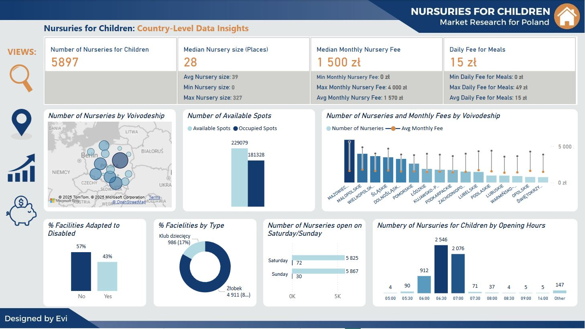
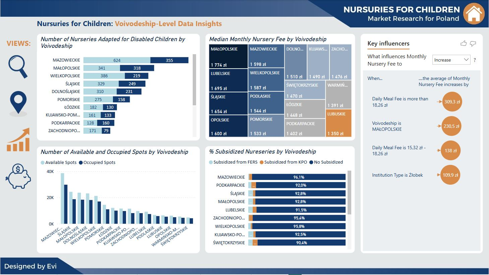
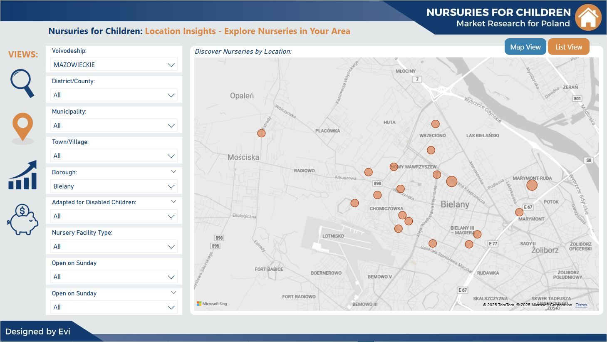
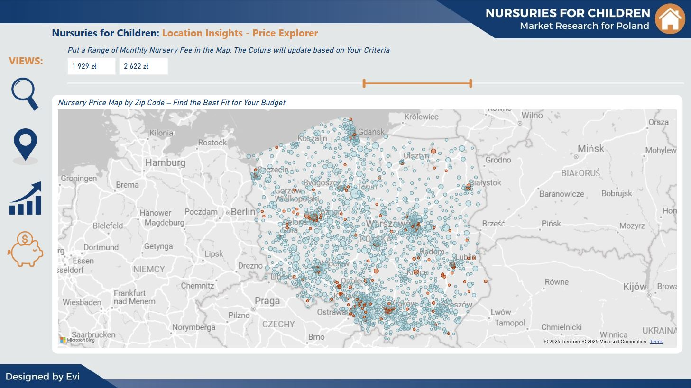

#### *Technical Skills: Power BI, Canva, Python spripts*
## Project Objective: 
The objective of this project is to develop a comprehensive financial dashboard for Paper & Ink Co. to support strategic financial analysis and reporting. The dashboard integrates key financial data and visualizations to provide stakeholders with a clear and consolidated view of the company’s financial health. 

This dashboard enables: 

- Real-time tracking of Revenue, COGS, Gross Profit, Operating Expenses, and Net Profit. 

- Income Statement reports with monthly breakdowns of revenue streams, costs, EBITDA, and Net Income. 

- Balance Sheet reports showing the structure of Assets, Liabilities, and Equity over time. 

- Analysis of financial performance by Account and Category, enabling drill-down capabilities. 

- Currency switch between Local Currency and USD. 

- Filtering by Year and Month for customized time-period analysis.

- Helps finance teams monitor trends, assess profitability, and ensure accurate financial planning. 

## Dataset Involved:
The dashboard was built using multiple datasets containing synthetic transaction records. These datasets were generated with Python scripts designed to simulate diverse financial scenarios. Each dataset represents transactions posted to specific accounts across different periods, supporting the construction of the income statement and balance sheet views.

<B>*Download file script from Github:*</B> <a href="https://github.com/analysteva/Project1-/blob/61adb5320e7d083e70abda01e7cc191ac5b9aaa4/RZ-instytucje.csv"> generate_transactions_BS_Jan_Dec_2022 </a>

<B>*Download file script from Github:*</B> <a href="https://github.com/analysteva/Project1-/blob/61adb5320e7d083e70abda01e7cc191ac5b9aaa4/RZ-instytucje.csv"> generate_transactions_IS_Jan_Dec_2022 </a>

## Data Visualization:
Below visuals have been made in Power BI desktop and describing results gathered from the datasets:

*Country-level data insights:*

*Voivodeship-level data insights:*

*Nurseries Explorer - find a place near your location:*

*Price Explorer:*

## Key Insights:
#### Country-level 
- Poland has nearly 5,900 nurseries, but availability remains a challenge, with a significant portion of spots already occupied. 

- The cost of childcare varies widely, with monthly fees ranging from 0 zł to 4,000 zł, and notable regional disparities. 

- Only 43% of nurseries are adapted for children with disabilities, highlighting the need for improved accessibility. 

- Weekend childcare options are extremely limited, with just 72 nurseries open on Saturdays and 30 on Sundays. 

- A large majority (83%) of childcare facilities are traditional nurseries, while children's clubs make up only 17% of the sector.

#### Voivodeship-level 
- Mazowieckie, Śląskie, and Małopolskie have the highest nursery demand, yet their fees are among the highest—additional subsidies or expanded capacity could improve affordability and accessibility. 

- Zachodniopomorskie and Podkarpackie have the fewest nurseries adapted for disabled children, highlighting a need for better inclusion efforts and funding in these regions. 

- Lubuskie and Podkarpackie have the lowest nursery fees, but also fewer available spots, suggesting that increasing the number of nurseries in these areas could improve accessibility. 

- Meal costs significantly impact overall childcare expenses, especially when exceeding 18.26 zł per day-introducing meal subsidies or cost regulations could make nurseries more affordable. 

- Despite high subsidy rates in many voivodeships, nursery fees remain high in places like Małopolskie-evaluating the effectiveness of subsidies and adjusting funding distribution could better support families. 
  <!--## Download the project in .pdf-->

