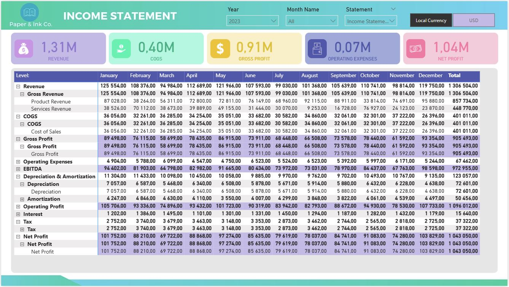

#### *Technical Skills: Power BI, Canva, Python spripts*
## Project Objective: 
The objective of this project is to develop a comprehensive financial dashboard for Paper & Ink Co. to support strategic financial analysis and reporting. The dashboard integrates key financial data and visualizations to provide stakeholders with a clear and consolidated view of the company’s financial health. 

This dashboard enables: 

- Real-time tracking of Revenue, COGS, Gross Profit, Operating Expenses, and Net Profit. 

- Income Statement reports with monthly breakdowns of revenue streams, costs, EBITDA, and Net Income. 

- Balance Sheet reports showing the structure of Assets, Liabilities, and Equity over time. 

- Analysis of financial performance by Account and Category, enabling drill-down capabilities. 

- Currency switch between Local Currency and USD. 

- Filtering by Year and Month for customized time-period analysis.

- Helps finance teams monitor trends, assess profitability, and ensure accurate financial planning. 

## Dataset Involved:
The dashboard was built using multiple datasets containing synthetic transaction records. These datasets were generated with Python scripts designed to simulate diverse financial scenarios. Each dataset represents transactions posted to specific accounts across different periods, supporting the construction of the income statement and balance sheet views.

The below Python scripts were specifically configured to generate transaction files from January to December 2022, ensuring a full year of financial data was available for dashboard construction.

<B>*Download file scripts from Github:*</B> 
- <a href="https://github.com/analysteva/Project4/blob/main/generate_transactions_BS.py"> generate_transactions_BS </a>
        
- <a href="https://github.com/analysteva/Project4/blob/main/generate_transactions_IS.py"> generate_transactions_IS </a>

## Data Visualization:
Below visuals have been made in Power BI desktop and describing results gathered from the datasets:

*Finance Overview:*

*Income Statement:*

*Balance Sheet:*

